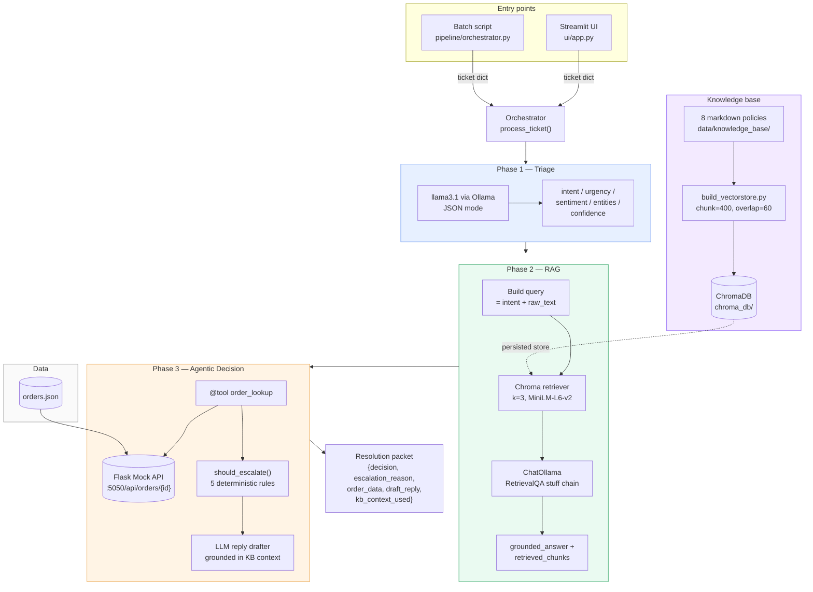

# ShopSense AI — Architecture

## System diagram

## Data flow per ticket

1. A ticket dict (`ticket_id`, `customer_id`, `text`, `channel`) enters the orchestrator from the UI or a batch run.
2. **Phase 1** calls Ollama with a strict JSON schema. On parse failure, the orchestrator retries with a stricter prompt; on a second failure, it falls back to a neutral default packet and marks `confidence = 0.0`.
3. **Phase 2** constructs a query from `intent + raw_text`, retrieves the top 3 chunks from Chroma, and runs a `RetrievalQA` "stuff" chain to produce a grounded answer with source attribution.
4. **Phase 3** (a) calls the mock Order API via a LangChain `@tool` if an `order_id` was extracted, (b) runs **deterministic** escalation rules over the triage + order data — never asks the LLM whether to escalate, (c) drafts a customer reply with the LLM, conditioning on the KB context, the order data, and the resolve/escalate decision.
5. The orchestrator returns a single packet combining all three phase outputs.

## Component contracts

| Phase | Input | Output |
|---|---|---|
| 1 — Triage | `{ticket_id, customer_id, text, channel}` | `{intent, urgency, sentiment, entities, confidence, raw_text, ticket_id, customer_id}` |
| 2 — RAG | triage dict | `{ticket_id, query_used, retrieved_chunks[], grounded_answer}` |
| 3 — Agent | triage dict + rag dict | `{ticket_id, decision, escalation_reason, order_data, draft_reply, kb_context_used, resolved}` |

## Escalation rules (deterministic)

The agent **never** delegates the resolve/escalate decision to the LLM. The five rules in [`pipeline/phase3_agent.py`](../pipeline/phase3_agent.py) `should_escalate()`:

1. Order ID not found in the system.
2. Order delayed beyond the 14-day shipping SLA.
3. Order flagged `lost_in_transit`.
4. `urgency == "high"` **and** `sentiment == "angry"`.
5. `intent == "complaint"` with no order reference.

This guarantees auditable, testable behavior on the highest-stakes part of the workflow.

## Why three phases, not one big agent

We considered a single autonomous agent that decided everything (classify, retrieve, look up, escalate, reply). We rejected it because the escalation decision needs deterministic guarantees a customer-support team can audit, and because chaining specialized stages is dramatically easier to evaluate, debug, and improve in production. See [`tradeoffs.md`](tradeoffs.md) for the full rationale.
